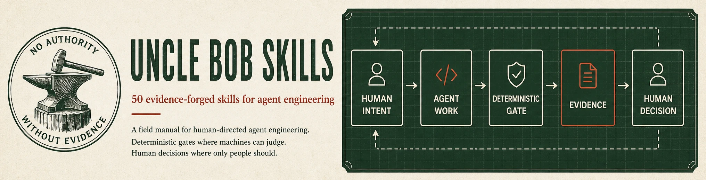

<h1 aria-label="Uncle Bob Skills">
  <picture>
    <source media="(max-width: 640px)" srcset="assets/readme/uncle-bob-skills-hero-mobile.webp">
    
  </picture>
</h1>

**A field manual for human-directed agent engineering.** Fifty portable skills for controlling agent work, proving outcomes, and protecting the architecture agents build.

[Start by outcome](#start-by-outcome) · [Run a power-user loop](#power-user-loops) · [Browse all 50 skills](docs/catalog.md) · [Install](#install-the-pack) · [Verify](#verify-the-pack) · [Read the evidence](docs/README.md)

## Start by outcome

These are curated entry points, not popularity rankings. The repository does not have per-skill adoption telemetry.

| Control the work | Prove the result | Shape the architecture |
|---|---|---|
| Keep agents inside the lines you set. | Require evidence from checks that can fail. | See the system, constrain direction, and improve its partitions. |
| **[#1 Seat Relay](skills/seat-relay/SKILL.md)**<br>Move one story through fresh-context specialist seats. | **[#15 Known-Dirty Fixture](skills/known-dirty-fixture/SKILL.md)**<br>Trust a checker only after watching it fail red. | **[#12 Arch Lens](skills/arch-lens/SKILL.md)**<br>Build a navigable picture of the repository. |
| **[#8 Steering Audit](skills/steering-audit/SKILL.md)**<br>Move checkable prompt rules into deterministic gates. | **[#25 Gherkin Gate](skills/gherkin-gate/SKILL.md)**<br>Bind red-before-green evidence to acceptance scenarios. | **[#7 Dependency Fence](skills/dependency-fence/SKILL.md)**<br>Declare and check dependency direction. |
| **[#18 Thrash Watch](skills/thrash-watch/SKILL.md)**<br>Recognize agent struggle and choose the next intervention. | **[#4 CRAP Gate](skills/crap-gate/SKILL.md)**<br>Cap coverage-weighted complexity per function. | **[#37 Parnas Partition](skills/parnas-partition/SKILL.md)**<br>Make every module name the decision it hides. |

| **50** skills | **36** tool-backed | **14** playbooks | **5 + 1** verification commands |
|---:|---:|---:|---:|
| One connected pack | Scripts where a machine can judge | Judgment where arithmetic would be theatre | Five content gates + one release-integrity check |

Designed and released by **Island Development Crew**: human-directed, agent-executed, and gate-verified. Human intent, boundaries, thresholds, risk acceptance, design ownership, and release authority remain human-owned.

> [!NOTE]
> **How release trust works:** local gates verify only the content claims named below; they do not create release authority. Production status lives on an [authenticated GitHub release](https://github.com/Island-Dev-Crew/uncle-bob-skills/releases) for an exact commit, alongside its independent exact-head review receipt. The [changelog](CHANGELOG.md) preserves the corrective history.

## Power-user loops

Each loop is a practical reading and operating order. Open the first skill when that is the problem in front of you.

| You need to… | Start here | Then compose |
|---|---|---|
| **Ship a feature with an acceptance trail** | [#17 Story Cadence](skills/story-cadence/SKILL.md) | [#2 Specifier Seat](skills/specifier-seat/SKILL.md) → [#3 QA Script Seat](skills/qa-script-seat/SKILL.md) → [#25 Gherkin Gate](skills/gherkin-gate/SKILL.md) → [#35 Acceptance Surface Review](skills/acceptance-surface-review/SKILL.md) |
| **Harden a quality gate** | [#15 Known-Dirty Fixture](skills/known-dirty-fixture/SKILL.md) | [#4 CRAP Gate](skills/crap-gate/SKILL.md) → [#5 Mutant Hunt](skills/mutant-hunt/SKILL.md) → [#34 Coverage Gaming Audit](skills/coverage-gaming-audit/SKILL.md) → [#45 Measurement Humility](skills/measurement-humility/SKILL.md) |
| **Repair architecture before it calcifies** | [#13 Structure Interrogation](skills/structure-interrogation/SKILL.md) | [#12 Arch Lens](skills/arch-lens/SKILL.md) → [#37 Parnas Partition](skills/parnas-partition/SKILL.md) → [#7 Dependency Fence](skills/dependency-fence/SKILL.md) → [#38 Coupling Budget](skills/coupling-budget/SKILL.md) |
| **Recover a drifting agent session** | [#8 Steering Audit](skills/steering-audit/SKILL.md) | [#9 Priority Zone](skills/priority-zone/SKILL.md) → [#36 Instruction Density Cap](skills/instruction-density-cap/SKILL.md) → [#10 Trajectory Hygiene](skills/trajectory-hygiene/SKILL.md) → [#18 Thrash Watch](skills/thrash-watch/SKILL.md) |
| **Scale a fleet without losing the margin** | [#44 Do It Twice](skills/do-it-twice/SKILL.md) | [#40 Mythical Agent Month](skills/mythical-agent-month/SKILL.md) → [#19 Margin Ledger](skills/margin-ledger/SKILL.md) → [#47 Change Cost Probe](skills/change-cost-probe/SKILL.md) → [#46 Plan Decay Detector](skills/plan-decay-detector/SKILL.md) |

## Catalog preview

| # | Skill | Use it to | Kind |
|---:|---|---|---|
| 1 | [Seat Relay](skills/seat-relay/SKILL.md) | Control one story through a fresh-context specialist relay. | Playbook |
| 4 | [CRAP Gate](skills/crap-gate/SKILL.md) | Put a per-function ceiling on complexity weighted by coverage. | Tool-backed |
| 8 | [Steering Audit](skills/steering-audit/SKILL.md) | Separate prompt-worthy guidance from rules a gate should own. | Tool-backed |
| 12 | [Arch Lens](skills/arch-lens/SKILL.md) | Give humans and agents a shared, drill-down structural view. | Tool-backed |
| 15 | [Known-Dirty Fixture](skills/known-dirty-fixture/SKILL.md) | Prove a checker can reject a known violation before trusting it. | Tool-backed |
| 18 | [Thrash Watch](skills/thrash-watch/SKILL.md) | Recognize circling, contamination, and give-up signatures early. | Playbook |
| 39 | [Conceptual Integrity Owner](skills/conceptual-integrity-owner/SKILL.md) | Keep one named human accountable for the system's design. | Playbook |
| 46 | [Plan Decay Detector](skills/plan-decay-detector/SKILL.md) | Detect when the plan's assumptions no longer match the tree. | Tool-backed |

**[Browse the complete 50-skill catalog by outcome →](docs/catalog.md)**

## Legend

| Label | What it means |
|---|---|
| **Tool-backed** | The skill ships one or more first-party scripts. That does not mean it is automatically wired into your CI or agent harness. |
| **Playbook** | The skill provides an operating discipline or human decision process that should not be disguised as arithmetic. |
| **Enforced** | A specific claim has a named executable check and documented verdicts. Each skill states its own enforced surface. |
| **Advisory** | The rule still depends on judgment, external wiring, or evidence the repository cannot honestly mechanize. |

## The operating loop

The pack separates work a machine can verify from decisions only a person can own:

1. A human defines intent and boundaries.
2. An agent performs bounded work.
3. A deterministic gate returns a checkable verdict where one is possible.
4. Evidence is preserved instead of summarized away.
5. A human accepts, rejects, redirects, or changes the system.

That loop is governed by two laws:

> **No authority without evidence.** Nothing claims done without a captured result from a check that could have failed.

> **Values transfer; disciplines do not; thresholds move.** Keep the value, drop the human ritual, and retune the number by experiment.

## Install the pack

The supported topology is the **whole repository**. The skills share root-level evidence, validators, and sibling references; copying a single island produces a reading copy, not the connected evidence graph.

```bash
git clone https://github.com/Island-Dev-Crew/uncle-bob-skills.git
cd uncle-bob-skills
```

Reading and loading the Markdown skill contracts requires no package install. Each tool-backed skill documents its own narrower runtime; many use only Bash or standard-library Python. Running the complete pack-wide verification matrix requires Python 3.10+ with the pinned dependencies in [`requirements.txt`](requirements.txt) for YAML validation and CommonMark parsing, plus Bash, Git, and standard POSIX utilities in a UTF-8-capable shell environment. Native Windows execution is not certified.

For Claude Code, load the intact clone as a local plugin:

```bash
claude --plugin-dir "$PWD"
```

Claude Code discovers all fifty islands from the plugin's `skills/` directory under the `uncle-bob-skills` namespace—for example, `/uncle-bob-skills:seat-relay`. The flag loads this checkout for that session and keeps every root-level evidence link intact. Pull updates in the clone, then start the next session from the same command. See [Claude Code's local-plugin documentation](https://code.claude.com/docs/en/plugins#test-your-plugins-locally).

Do not copy only `skills/*` into a personal skills directory: several islands intentionally link to the repository's root-level research, docs, companion map, and validators, and an island-only copy severs that graph.

The islands use portable `SKILL.md` files with `agents/openai.yaml` sidecars. For Codex, Pi, Hermes, or another compatible harness, connect the intact clone using that harness's own installation documentation and preserve the repository root as readable context; this repository does not invent one universal command for loaders it does not control.

The local gates are standalone, but not every end-to-end protocol is: three workflow steps hand off to non-vendored IDC Skills Forge islands. [The companion map](COMPANION.md) names those boundaries and what you must supply if the Forge is unavailable.

The repository's [`.gitattributes`](.gitattributes) pins tracked bytes with `* -text`, preventing Git from silently rewriting shell gates to CRLF. Re-clone or renormalize a checkout created before that policy landed.

## Verify the pack

Run the checks from a trusted checkout with UTF-8 stdout (`PYTHONIOENCODING=utf-8` is sufficient when your terminal or CI collector is not UTF-8):

```bash
python3 -m venv .venv
. .venv/bin/activate
python3 -m pip install -r requirements.txt

PYTHONIOENCODING=utf-8 python3 scripts/validate-island.py skills/*/
PYTHONIOENCODING=utf-8 python3 scripts/lane-check.py
PYTHONIOENCODING=utf-8 python3 scripts/verify-proofs.py
PYTHONIOENCODING=utf-8 python3 scripts/closed-stream-check.py
PYTHONIOENCODING=utf-8 python3 scripts/link-check.py
PYTHONIOENCODING=utf-8 python3 scripts/verify-release.py
```

What those commands establish:

| Check | Claim it tests |
|---|---|
| `validate-island.py` | Every island satisfies the pack's structural contract. |
| `lane-check.py` | Recognized static source forms in shipped scripts satisfy their declared lanes; the checker's documented literal-grammar and indirection limits still apply. |
| `verify-proofs.py` | Eligible, sequenced proof commands reproduce their documented exit codes; other candidates are reported as PENDING, TEMPLATE, SKIPPED, REFUSED, or UNSEQUENCED. |
| `closed-stream-check.py` | Eligible proof commands retain their documented verdict, or fail closed with the pack-wide I/O seal, when output streams disappear; commands that close a stream themselves are counted but not re-probed. |
| `link-check.py` | Relative file and directory targets discovered in rendered Markdown and raw HTML resolve in the checked commit; URL fragments are not validated. |
| `verify-release.py` | The committed file manifest matches `RELEASE-DIGEST.txt`; authorship and commit identity still require an external signed tag or release witness. |

> [!IMPORTANT]
> `verify-proofs.py` executes proof commands contained in this repository. Run it only on a checkout you trust. The five content checks establish only the claims in the table; release verification establishes content consistency, not authorship. No green command grants release acceptance, merge authority, or a human design decision.

Maintainers also run the certifiers' own watched-red suites before a release:

```bash
PYTHONIOENCODING=utf-8 python3 scripts/self-test-validate-island.py
PYTHONIOENCODING=utf-8 python3 scripts/fixtures/lane-breaches/check-regressions.py
PYTHONIOENCODING=utf-8 python3 scripts/fixtures/proof-grammar-island/check-parser-regressions.py
PYTHONIOENCODING=utf-8 python3 scripts/fixtures/proof-grammar-island/check-host-independent.py
PYTHONIOENCODING=utf-8 python3 scripts/fixtures/verdict-flip-island/check-nested-substitution.py
PYTHONIOENCODING=utf-8 python3 scripts/self-test-link-check.py
PYTHONIOENCODING=utf-8 python3 scripts/self-test-verify-release.py
PYTHONIOENCODING=utf-8 python3 skills/mutant-hunt/scripts/fixtures/check-readonly.py
PYTHONIOENCODING=utf-8 python3 skills/steering-audit/scripts/self-test-readonly-probe.py
```

Those suites test the checkers themselves. They are deliberately separate from the five content gates, which must not quietly certify their own implementation.

Each tool reports its own current totals. The README deliberately avoids copying fast-drifting probe counts into marketing copy.

## How this was forged

| Human-owned | Agent-executed | Gate-verified | Publicly preserved |
|---|---|---|---|
| Intent, boundaries, thresholds, exceptions, design ownership, risk acceptance, and release decisions. | Source extraction, island construction, fixture generation, adversarial review, and documentation production. | Structural checks, proof replay, lane boundaries, closed-stream behavior, and committed links. | Concepts, research, build records, gauntlet findings, known limits, changelog, and source-regeneration instructions. |

The ideas were drawn from Robert C. Martin's 2026 conversation with Matt Pocock and the engineering canon behind it. The public construction record stays available for scrutiny, but it is documentation—not the product's front door.

**[Open the documentation and evidence map →](docs/README.md)**

## Credit and license

The core engineering principles are drawn from Robert C. Martin's conversation with Matt Pocock ([video](https://www.youtube.com/live/zcLPGC-tvgk)); Island Development Crew authored this adaptation, skill design, tooling, and verification system. Martin's public tools—[swarm-forge](https://github.com/unclebob/swarm-forge), [crap4java](https://github.com/unclebob/crap4java), [crap4go](https://github.com/unclebob/crap4go), and [crap4clj](https://github.com/unclebob/crap4clj)—are worth studying as primary examples.

[MIT](LICENSE) © 2026 Island Development Crew. The MIT grant covers this repository's original work. The full recording, transcript, and captions are not redistributed; short quotations and cited still excerpts are third-party material outside that grant. See [NOTICE](NOTICE.md) and [source notes](source/README.md).

**No authority without evidence.**

Island Development Crew · Huntsville, Alabama
